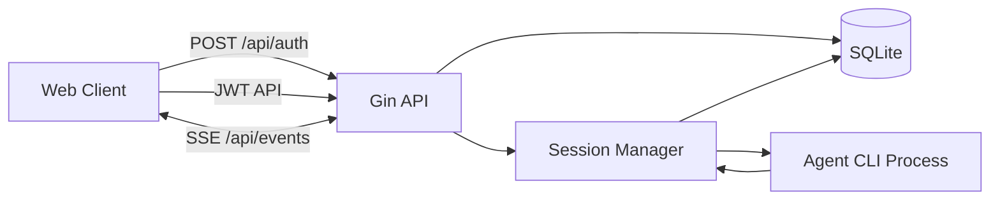

# hapi-lite 仓库说明文档

## 1. 项目概述
`hapi-lite` 是一个 **Go 后端 + React 前端** 的轻量级会话管理与 AI Agent 交互系统。

核心能力：
- 会话管理（创建、恢复、归档、删除、改名）。
- 消息收发与分页拉取。
- 多 Agent 风味支持（claude、codex、gemini、opencode）。
- 文件浏览/检索/读取、Git 状态与 Diff。
- SSE 实时事件推送。
- 前端 PWA、国际化、聊天 UI 与工具调用卡片展示。

## 2. 整体流程架构
### 2.1 启动流程
1. `main.go` 启动进程，加载 `config.yaml`（不存在则走默认配置）。
2. 初始化 SQLite 存储并自动建表。
3. 初始化 SSE Broker。
4. 初始化 Session Manager（负责 Agent 进程生命周期）。
5. 装配 Gin 路由：开放鉴权接口 + 受保护业务接口。
6. 启动 HTTP 服务（默认 `:8080`）。
7. 非 `/api/*` 路径由后端直接托管 `web/dist` 静态资源并做 SPA 回退。

### 2.2 业务主流程
1. 前端通过 `/api/auth` 提交 access token 获取 JWT。
2. 前端使用 JWT 调用会话/消息/文件/Git 等接口。
3. 会话发送消息时，若对应 Agent 未运行则按需拉起。
4. Agent 输出被解析后写入 SQLite。
5. 事件通过 SSE 广播给前端，前端增量刷新会话与消息状态。

## 3. 技术架构
### 3.1 后端
- 语言与运行时：Go 1.24.x
- Web 框架：Gin
- 鉴权：JWT（HS256）
- 存储：SQLite（WAL）
- 实时通信：SSE（发布订阅 Broker）
- 进程执行：`os/exec` 调用外部 Agent CLI

### 3.2 前端
- 框架：React 19 + TypeScript
- 构建工具：Vite
- 路由：TanStack Router
- 数据层：TanStack Query
- UI：TailwindCSS + 组件化模块
- 实时：SSE（消息/会话状态同步）
- PWA：`vite-plugin-pwa`
- 终端：xterm.js + socket.io-client（前端侧）

### 3.3 部署形态
- 开发态：后端独立运行，前端由 Vite Dev Server 运行并反向代理 `/api`。
- 生产态：后端进程托管 `web/dist` 静态文件（当前代码未使用 `go:embed`，需保留 `web/dist` 目录）。

## 4. 开发说明
### 4.1 环境要求
- Go 1.24+
- Node.js + npm

### 4.2 常用命令
- 安装前端依赖：`make install-web`
- 启动后端（开发）：`make dev`
- 启动前端 Vite：`make web`

### 4.3 本地联调建议
1. 终端 A 执行 `make dev`（后端 `:8080`）。
2. 终端 B 执行 `make web`（前端开发服务器）。
3. 在登录页输入 `config.yaml` 里的 `access_token`（默认 `hapi-lite-token`）。

## 5. 编译与运行说明
### 5.1 构建
- 仅后端二进制：`make build`
- 仅前端静态资源：`make build-web`
- 前后端一起构建：`make build-all`

### 5.2 运行
- 运行后端：`./hapi-lite`
- 默认监听端口：`8080`（可由 `config.yaml` 配置）

### 5.3 打包注意事项
- 当前仓库是“后端托管前端静态文件”的模式，不是前端内嵌到二进制。
- 发布时需要保证二进制旁存在 `web/dist` 目录（或改造为 embed 模式）。

## 6. 文件说明范围
- 以下清单按“当前目录文件”生成，逐文件给出用途说明。
- `web/node_modules`、`web/dist` 为依赖与构建产物，文件量巨大，未逐项展开。

## 7. 逐文件说明（每个文件）
| 文件 | 说明 |
|---|---|
| `.air.toml` | Air 配置文件（当前默认开发流程未使用） |
| `.gitignore` | 仓库忽略规则 |
| `.serena/.gitignore` | Serena 工作目录忽略规则 |
| `.serena/cache/typescript/document_symbols.pkl` | Serena TypeScript 符号缓存 |
| `.serena/cache/typescript/raw_document_symbols.pkl` | Serena TypeScript 原始符号缓存 |
| `.serena/project.yml` | Serena 项目元信息 |
| `Makefile` | 常用开发与构建命令入口 |
| `config.yaml` | 运行时配置（端口、JWT 密钥、访问令牌、DB 路径） |
| `go.mod` | Go 模块定义与依赖声明 |
| `go.sum` | Go 依赖校验和 |
| `hapi-lite` | 后端已编译二进制产物（运行产物） |
| `hapi-lite.db` | SQLite 主数据库文件（运行产物） |
| `hapi-lite.db-shm` | SQLite WAL 共享内存文件（运行产物） |
| `hapi-lite.db-wal` | SQLite WAL 日志文件（运行产物） |
| `internal/api/auth_handler.go` | 登录与绑定接口（/api/auth、/api/bind） |
| `internal/api/base.go` | API Handler 基类（注入 Store、Broker、Manager） |
| `internal/api/file_handler.go` | 会话文件检索、读取、目录浏览与上传管理接口 |
| `internal/api/git_handler.go` | 会话目录 Git 状态与 Diff 接口 |
| `internal/api/machine_handler.go` | 机器列表、会话创建与路径存在性检查接口 |
| `internal/api/message_handler.go` | 消息分页查询与发送接口 |
| `internal/api/misc_handler.go` | 可见性与推送占位接口 |
| `internal/api/permission_handler.go` | 权限请求审批接口 |
| `internal/api/router.go` | Gin 路由装配、鉴权分组、CORS、SPA 静态托管 |
| `internal/api/session_handler.go` | 会话 CRUD、恢复、归档、改名、技能/命令列表接口 |
| `internal/api/sse_handler.go` | SSE 事件订阅与心跳推送接口 |
| `internal/auth/auth.go` | JWT 生成与中间件鉴权 |
| `internal/config/config.go` | 配置结构与 config.yaml 加载逻辑 |
| `internal/scanner/claude.go` | Claude 会话文件扫描器 |
| `internal/scanner/codex.go` | Codex 会话文件解析与消息转换 |
| `internal/scanner/codex_test.go` | Codex 消息转换单元测试 |
| `internal/scanner/gemini.go` | Gemini 会话文件扫描器 |
| `internal/scanner/opencode.go` | OpenCode 会话文件扫描器 |
| `internal/scanner/scanner.go` | 扫描器抽象接口与通用消息结构 |
| `internal/session/manager.go` | Agent 进程生命周期管理、命令执行与消息回传 |
| `internal/session/types.go` | 会话/消息/请求的核心数据模型定义 |
| `internal/sse/broker.go` | SSE 订阅发布 Broker |
| `internal/store/sqlite.go` | SQLite 存储实现、建表迁移与数据访问 |
| `main.go` | 程序入口：加载配置、初始化存储/SSE/会话管理并启动 HTTP 服务 |
| `tsconfig.base.json` | 前端 TypeScript 基础配置 |
| `web/.gitignore` | 前端目录忽略规则 |
| `web/README.md` | 前端子项目说明文档 |
| `web/index.html` | Vite HTML 入口模板 |
| `web/package-lock.json` | NPM 锁定依赖版本 |
| `web/package.json` | 前端脚本、依赖与构建配置 |
| `web/postcss.config.cjs` | PostCSS 插件配置 |
| `web/public/apple-touch-icon-180x180.png` | PWA 与移动端图标资源 |
| `web/public/favicon.ico` | 站点 favicon |
| `web/public/icon.svg` | 应用主图标资源 |
| `web/public/mask-icon.svg` | Safari pinned tab 图标资源 |
| `web/public/maskable-icon-512x512.png` | PWA maskable 图标资源 |
| `web/public/pwa-192x192.png` | PWA 图标（192x192） |
| `web/public/pwa-512x512.png` | PWA 图标（512x512） |
| `web/public/pwa-64x64.png` | PWA 图标（64x64） |
| `web/src/App.tsx` | 前端根应用：认证、SSE、路由容器与全局状态管理 |
| `web/src/api/client.ts` | API 客户端封装（鉴权、请求、错误处理） |
| `web/src/chat/modelConfig.ts` | 聊天状态处理模块（归一化、reducer、展示模型） |
| `web/src/chat/normalize.ts` | 聊天状态处理模块（归一化、reducer、展示模型） |
| `web/src/chat/normalizeAgent.ts` | 聊天状态处理模块（归一化、reducer、展示模型） |
| `web/src/chat/normalizeUser.ts` | 聊天状态处理模块（归一化、reducer、展示模型） |
| `web/src/chat/presentation.ts` | 聊天状态处理模块（归一化、reducer、展示模型） |
| `web/src/chat/reconcile.ts` | 聊天状态处理模块（归一化、reducer、展示模型） |
| `web/src/chat/reducer.ts` | 聊天状态处理模块（归一化、reducer、展示模型） |
| `web/src/chat/reducerCliOutput.ts` | 聊天状态处理模块（归一化、reducer、展示模型） |
| `web/src/chat/reducerEvents.ts` | 聊天状态处理模块（归一化、reducer、展示模型） |
| `web/src/chat/reducerTimeline.ts` | 聊天状态处理模块（归一化、reducer、展示模型） |
| `web/src/chat/reducerTools.ts` | 聊天状态处理模块（归一化、reducer、展示模型） |
| `web/src/chat/tracer.ts` | 聊天状态处理模块（归一化、reducer、展示模型） |
| `web/src/chat/types.ts` | 聊天状态处理模块（归一化、reducer、展示模型） |
| `web/src/components/AssistantChat/AttachmentItem.tsx` | Assistant Chat 主体与输入区组件 |
| `web/src/components/AssistantChat/ComposerButtons.tsx` | Assistant Chat 主体与输入区组件 |
| `web/src/components/AssistantChat/HappyComposer.tsx` | Assistant Chat 主体与输入区组件 |
| `web/src/components/AssistantChat/HappyThread.tsx` | Assistant Chat 主体与输入区组件 |
| `web/src/components/AssistantChat/StatusBar.tsx` | Assistant Chat 主体与输入区组件 |
| `web/src/components/AssistantChat/context.tsx` | Assistant Chat 主体与输入区组件 |
| `web/src/components/AssistantChat/messages/AssistantMessage.tsx` | 聊天消息渲染子组件（按消息类型） |
| `web/src/components/AssistantChat/messages/MessageAttachments.tsx` | 聊天消息渲染子组件（按消息类型） |
| `web/src/components/AssistantChat/messages/MessageStatusIndicator.tsx` | 聊天消息渲染子组件（按消息类型） |
| `web/src/components/AssistantChat/messages/SystemMessage.tsx` | 聊天消息渲染子组件（按消息类型） |
| `web/src/components/AssistantChat/messages/ToolMessage.tsx` | 聊天消息渲染子组件（按消息类型） |
| `web/src/components/AssistantChat/messages/UserMessage.tsx` | 聊天消息渲染子组件（按消息类型） |
| `web/src/components/ChatInput/Autocomplete.tsx` | 前端页面与通用组件 |
| `web/src/components/ChatInput/FloatingOverlay.tsx` | 前端页面与通用组件 |
| `web/src/components/CliOutputBlock.tsx` | 前端页面与通用组件 |
| `web/src/components/CodeBlock.tsx` | 前端页面与通用组件 |
| `web/src/components/DiffView.tsx` | 前端页面与通用组件 |
| `web/src/components/FileIcon.tsx` | 前端页面与通用组件 |
| `web/src/components/InstallPrompt.tsx` | 前端页面与通用组件 |
| `web/src/components/LanguageSwitcher.tsx` | 前端页面与通用组件 |
| `web/src/components/LazyRainbowText.tsx` | 前端页面与通用组件 |
| `web/src/components/LoadingState.tsx` | 前端页面与通用组件 |
| `web/src/components/LoginPrompt.test.tsx` | 前端组件测试 |
| `web/src/components/LoginPrompt.tsx` | 前端页面与通用组件 |
| `web/src/components/MachineList.tsx` | 前端页面与通用组件 |
| `web/src/components/MarkdownRenderer.tsx` | 前端页面与通用组件 |
| `web/src/components/NewSession/ActionButtons.tsx` | 新建会话页面子组件与配置 |
| `web/src/components/NewSession/AgentSelector.tsx` | 新建会话页面子组件与配置 |
| `web/src/components/NewSession/DirectorySection.tsx` | 新建会话页面子组件与配置 |
| `web/src/components/NewSession/MachineSelector.tsx` | 新建会话页面子组件与配置 |
| `web/src/components/NewSession/ModelSelector.tsx` | 新建会话页面子组件与配置 |
| `web/src/components/NewSession/SessionTypeSelector.tsx` | 新建会话页面子组件与配置 |
| `web/src/components/NewSession/YoloToggle.tsx` | 新建会话页面子组件与配置 |
| `web/src/components/NewSession/index.tsx` | 新建会话页面子组件与配置 |
| `web/src/components/NewSession/preferences.test.ts` | 前端组件测试 |
| `web/src/components/NewSession/preferences.ts` | 新建会话页面子组件与配置 |
| `web/src/components/NewSession/types.ts` | 新建会话页面子组件与配置 |
| `web/src/components/OfflineBanner.tsx` | 前端页面与通用组件 |
| `web/src/components/ReconnectingBanner.tsx` | 前端页面与通用组件 |
| `web/src/components/RenameSessionDialog.tsx` | 前端页面与通用组件 |
| `web/src/components/SessionActionMenu.tsx` | 前端页面与通用组件 |
| `web/src/components/SessionChat.tsx` | 前端页面与通用组件 |
| `web/src/components/SessionFiles/DirectoryTree.tsx` | 会话文件浏览相关组件 |
| `web/src/components/SessionHeader.tsx` | 前端页面与通用组件 |
| `web/src/components/SessionList.tsx` | 前端页面与通用组件 |
| `web/src/components/SpawnSession.tsx` | 前端页面与通用组件 |
| `web/src/components/Spinner.tsx` | 前端页面与通用组件 |
| `web/src/components/SyncingBanner.tsx` | 前端页面与通用组件 |
| `web/src/components/Terminal/TerminalView.tsx` | 终端展示组件 |
| `web/src/components/ToastContainer.tsx` | 前端页面与通用组件 |
| `web/src/components/ToolCard/AskUserQuestionFooter.tsx` | 工具调用卡片与交互逻辑 |
| `web/src/components/ToolCard/PermissionFooter.tsx` | 工具调用卡片与交互逻辑 |
| `web/src/components/ToolCard/RequestUserInputFooter.tsx` | 工具调用卡片与交互逻辑 |
| `web/src/components/ToolCard/ToolCard.tsx` | 工具调用卡片与交互逻辑 |
| `web/src/components/ToolCard/askUserQuestion.ts` | 工具调用卡片与交互逻辑 |
| `web/src/components/ToolCard/icons.tsx` | 工具调用卡片与交互逻辑 |
| `web/src/components/ToolCard/knownTools.tsx` | 工具调用卡片与交互逻辑 |
| `web/src/components/ToolCard/requestUserInput.ts` | 工具调用卡片与交互逻辑 |
| `web/src/components/ToolCard/views/AskUserQuestionView.tsx` | 工具调用卡片视图组件 |
| `web/src/components/ToolCard/views/CodexDiffView.tsx` | 工具调用卡片视图组件 |
| `web/src/components/ToolCard/views/CodexPatchView.tsx` | 工具调用卡片视图组件 |
| `web/src/components/ToolCard/views/EditView.tsx` | 工具调用卡片视图组件 |
| `web/src/components/ToolCard/views/ExitPlanModeView.tsx` | 工具调用卡片视图组件 |
| `web/src/components/ToolCard/views/MultiEditView.tsx` | 工具调用卡片视图组件 |
| `web/src/components/ToolCard/views/RequestUserInputView.tsx` | 工具调用卡片视图组件 |
| `web/src/components/ToolCard/views/TodoWriteView.tsx` | 工具调用卡片视图组件 |
| `web/src/components/ToolCard/views/WriteView.tsx` | 工具调用卡片视图组件 |
| `web/src/components/ToolCard/views/_all.tsx` | 工具调用卡片视图组件 |
| `web/src/components/ToolCard/views/_results.tsx` | 工具调用卡片视图组件 |
| `web/src/components/assistant-ui/markdown-text.tsx` | assistant-ui 适配与渲染工具 |
| `web/src/components/assistant-ui/markdown-utils.ts` | assistant-ui 适配与渲染工具 |
| `web/src/components/assistant-ui/reasoning.tsx` | assistant-ui 适配与渲染工具 |
| `web/src/components/assistant-ui/shiki-highlighter.tsx` | assistant-ui 适配与渲染工具 |
| `web/src/components/icons.tsx` | 前端页面与通用组件 |
| `web/src/components/ui/ConfirmDialog.tsx` | 基础 UI 组件（按钮、对话框、Toast 等） |
| `web/src/components/ui/Toast.tsx` | 基础 UI 组件（按钮、对话框、Toast 等） |
| `web/src/components/ui/badge.tsx` | 基础 UI 组件（按钮、对话框、Toast 等） |
| `web/src/components/ui/button.tsx` | 基础 UI 组件（按钮、对话框、Toast 等） |
| `web/src/components/ui/card.tsx` | 基础 UI 组件（按钮、对话框、Toast 等） |
| `web/src/components/ui/dialog.tsx` | 基础 UI 组件（按钮、对话框、Toast 等） |
| `web/src/hooks/mutations/useSendMessage.ts` | React Query 写操作 Hook |
| `web/src/hooks/mutations/useSessionActions.ts` | React Query 写操作 Hook |
| `web/src/hooks/mutations/useSpawnSession.ts` | React Query 写操作 Hook |
| `web/src/hooks/queries/useGitStatusFiles.ts` | React Query 读操作 Hook |
| `web/src/hooks/queries/useMachines.ts` | React Query 读操作 Hook |
| `web/src/hooks/queries/useMessages.ts` | React Query 读操作 Hook |
| `web/src/hooks/queries/useSession.ts` | React Query 读操作 Hook |
| `web/src/hooks/queries/useSessionDirectory.ts` | React Query 读操作 Hook |
| `web/src/hooks/queries/useSessionFileSearch.ts` | React Query 读操作 Hook |
| `web/src/hooks/queries/useSessions.ts` | React Query 读操作 Hook |
| `web/src/hooks/queries/useSkills.ts` | React Query 读操作 Hook |
| `web/src/hooks/queries/useSlashCommands.ts` | React Query 读操作 Hook |
| `web/src/hooks/useActiveSuggestions.ts` | 前端业务 Hook |
| `web/src/hooks/useActiveWord.ts` | 前端业务 Hook |
| `web/src/hooks/useAppGoBack.ts` | 前端业务 Hook |
| `web/src/hooks/useAuth.ts` | 前端业务 Hook |
| `web/src/hooks/useAuthSource.ts` | 前端业务 Hook |
| `web/src/hooks/useCopyToClipboard.ts` | 前端业务 Hook |
| `web/src/hooks/useDirectorySuggestions.ts` | 前端业务 Hook |
| `web/src/hooks/useFontScale.ts` | 前端业务 Hook |
| `web/src/hooks/useLongPress.ts` | 前端业务 Hook |
| `web/src/hooks/useOnlineStatus.ts` | 前端业务 Hook |
| `web/src/hooks/usePWAInstall.ts` | 前端业务 Hook |
| `web/src/hooks/usePlatform.ts` | 前端业务 Hook |
| `web/src/hooks/usePointerFocusRing.ts` | 前端业务 Hook |
| `web/src/hooks/usePushNotifications.ts` | 前端业务 Hook |
| `web/src/hooks/useRecentPaths.ts` | 前端业务 Hook |
| `web/src/hooks/useSSE.ts` | 前端业务 Hook |
| `web/src/hooks/useScrollToBottom.ts` | 前端业务 Hook |
| `web/src/hooks/useServerUrl.ts` | 前端业务 Hook |
| `web/src/hooks/useSyncingState.ts` | 前端业务 Hook |
| `web/src/hooks/useTelegram.ts` | 前端业务 Hook |
| `web/src/hooks/useTerminalSocket.ts` | 前端业务 Hook |
| `web/src/hooks/useTheme.ts` | 前端业务 Hook |
| `web/src/hooks/useVisibilityReporter.ts` | 前端业务 Hook |
| `web/src/index.css` | 全局样式与主题变量 |
| `web/src/lib/agentFlavorUtils.ts` | 前端基础库与上下文工具 |
| `web/src/lib/app-context.tsx` | 前端基础库与上下文工具 |
| `web/src/lib/assistant-runtime.ts` | 前端基础库与上下文工具 |
| `web/src/lib/attachmentAdapter.ts` | 前端基础库与上下文工具 |
| `web/src/lib/clipboard.ts` | 前端基础库与上下文工具 |
| `web/src/lib/fileAttachments.ts` | 前端基础库与上下文工具 |
| `web/src/lib/gitParsers.ts` | 前端基础库与上下文工具 |
| `web/src/lib/i18n-context.tsx` | 前端基础库与上下文工具 |
| `web/src/lib/locales/en.ts` | 国际化语言包与索引 |
| `web/src/lib/locales/index.ts` | 国际化语言包与索引 |
| `web/src/lib/locales/zh-CN.ts` | 国际化语言包与索引 |
| `web/src/lib/message-window-store.ts` | 前端基础库与上下文工具 |
| `web/src/lib/messages.ts` | 前端基础库与上下文工具 |
| `web/src/lib/query-client.ts` | 前端基础库与上下文工具 |
| `web/src/lib/query-keys.ts` | 前端基础库与上下文工具 |
| `web/src/lib/recent-skills.ts` | 前端基础库与上下文工具 |
| `web/src/lib/runtime-config.ts` | 前端基础库与上下文工具 |
| `web/src/lib/shiki.ts` | 前端基础库与上下文工具 |
| `web/src/lib/terminalFont.ts` | 前端基础库与上下文工具 |
| `web/src/lib/toast-context.tsx` | 前端基础库与上下文工具 |
| `web/src/lib/toolInputUtils.ts` | 前端基础库与上下文工具 |
| `web/src/lib/use-translation.ts` | 前端基础库与上下文工具 |
| `web/src/lib/utils.ts` | 前端基础库与上下文工具 |
| `web/src/main.tsx` | 前端启动入口：初始化 Router、QueryClient、PWA、i18n |
| `web/src/protocol/index.ts` | 协议层类型、Schema 与消息定义 |
| `web/src/protocol/messages.ts` | 协议层类型、Schema 与消息定义 |
| `web/src/protocol/modes.ts` | 协议层类型、Schema 与消息定义 |
| `web/src/protocol/schemas.ts` | 协议层类型、Schema 与消息定义 |
| `web/src/protocol/sessionSummary.ts` | 协议层类型、Schema 与消息定义 |
| `web/src/protocol/socket.ts` | 协议层类型、Schema 与消息定义 |
| `web/src/protocol/types.ts` | 协议层类型、Schema 与消息定义 |
| `web/src/protocol/utils.ts` | 协议层类型、Schema 与消息定义 |
| `web/src/protocol/version.ts` | 协议层类型、Schema 与消息定义 |
| `web/src/router.tsx` | 前端路由定义与页面组合 |
| `web/src/routes/sessions/file.tsx` | 会话单文件查看页 |
| `web/src/routes/sessions/files.tsx` | 会话文件树与 Git 文件列表页 |
| `web/src/routes/sessions/terminal.tsx` | 会话终端页（xterm + socket.io） |
| `web/src/routes/settings/index.test.tsx` | 设置页单元测试 |
| `web/src/routes/settings/index.tsx` | 设置页 |
| `web/src/sw.ts` | PWA Service Worker 入口 |
| `web/src/test/setup.ts` | 前端测试环境初始化 |
| `web/src/types/api.ts` | 前端类型定义 |
| `web/src/types/diff.d.ts` | 前端类型定义 |
| `web/src/types/global.d.ts` | 前端类型定义 |
| `web/src/types/pwa.d.ts` | 前端类型定义 |
| `web/src/utils/applySuggestion.ts` | 前端通用工具函数 |
| `web/src/utils/findActiveWord.ts` | 前端通用工具函数 |
| `web/src/utils/path.ts` | 前端通用工具函数 |
| `web/tailwind.config.ts` | Tailwind 配置 |
| `web/tsconfig.json` | 前端 TypeScript 工程配置 |
| `web/vite.config.ts` | Vite 开发服务器、代理、PWA 与构建配置 |
| `web/vitest.config.ts` | Vitest 测试配置 |
